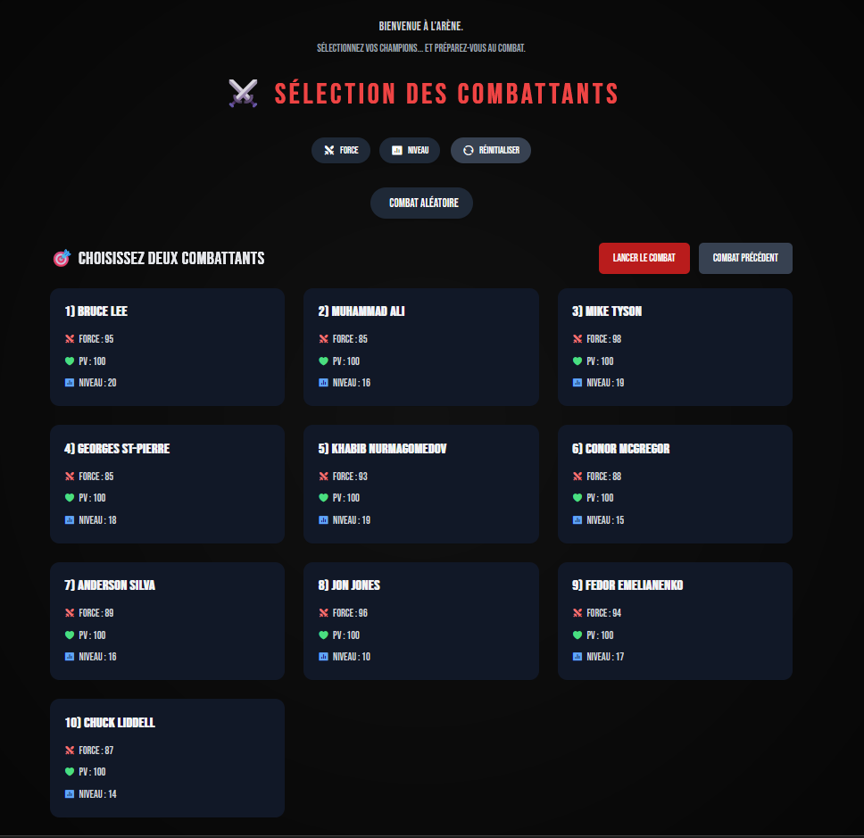

<h1 align="center">Random Combat Game</h1>

<p align=center>
    
</p>

## À propos

**Random Combat Game** est un jeu de combat aléatoire textuel. Ce projet a été réalisé dans le cadre de mes études à **EDEN School**.

## Installation

### 1. Cloner le dépôt

```
git clone https://github.com/Houdychou/random-combat-game.git
```

### 2. Utiliser le dépôt

```
cd random-combat-game
```

### 3. Créer le fichier d'environnement

```
copy .env.dist .env
vim .env
```

### 4. Installation des dépendances

Pour consulter la liste des dépendances, cliquez [ici](#dépendances).

```
composer install
```

### 5. Importation de la base de données

Importez le fichier SQL présent `/database/data.sql` dans **PhpMyAdmin**.

## Technologies

- PHP
- MySQL
- Tailwind CSS

## Dépendances

- [vlucas/phpdotenv](https://packagist.org/packages/vlucas/phpdotenv) (5.6)

## Contribution

Il y a deux moyens de contribuer au projet :
- [Pulls request](https://github.com/Houdychou/random-combat-game/pulls)
- [Issues](https://github.com/Houdychou/random-combat-game/issues)

## Licence

Pas de licence à l'heure actuelle.